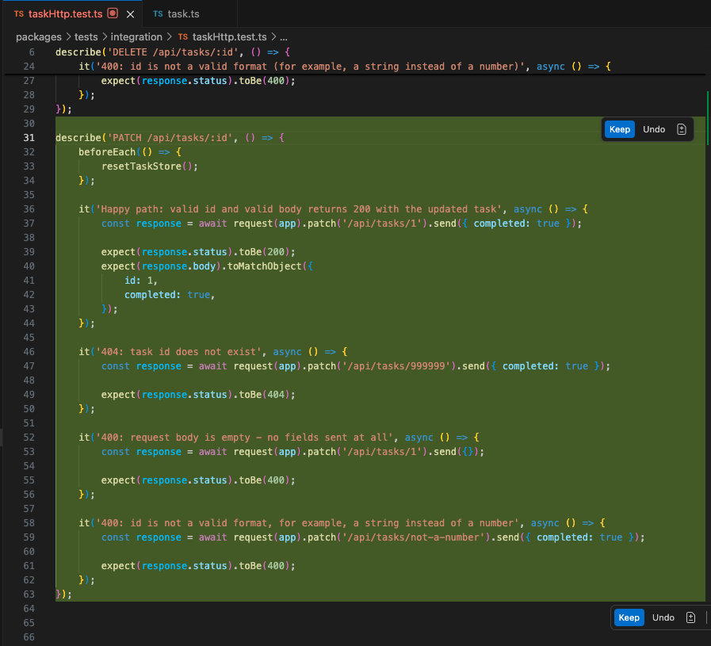
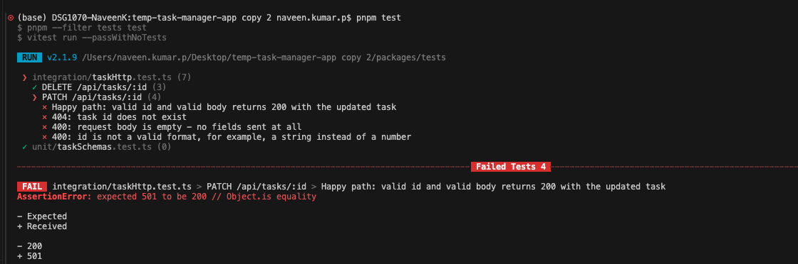
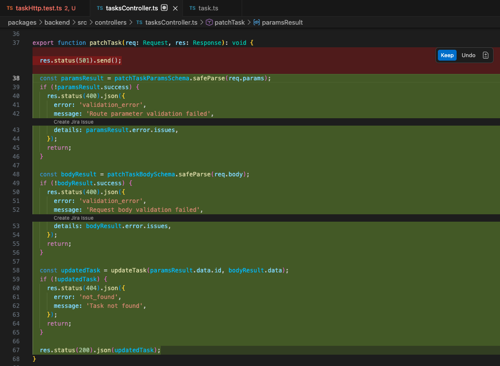
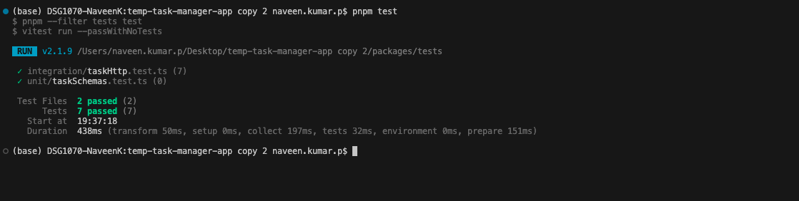
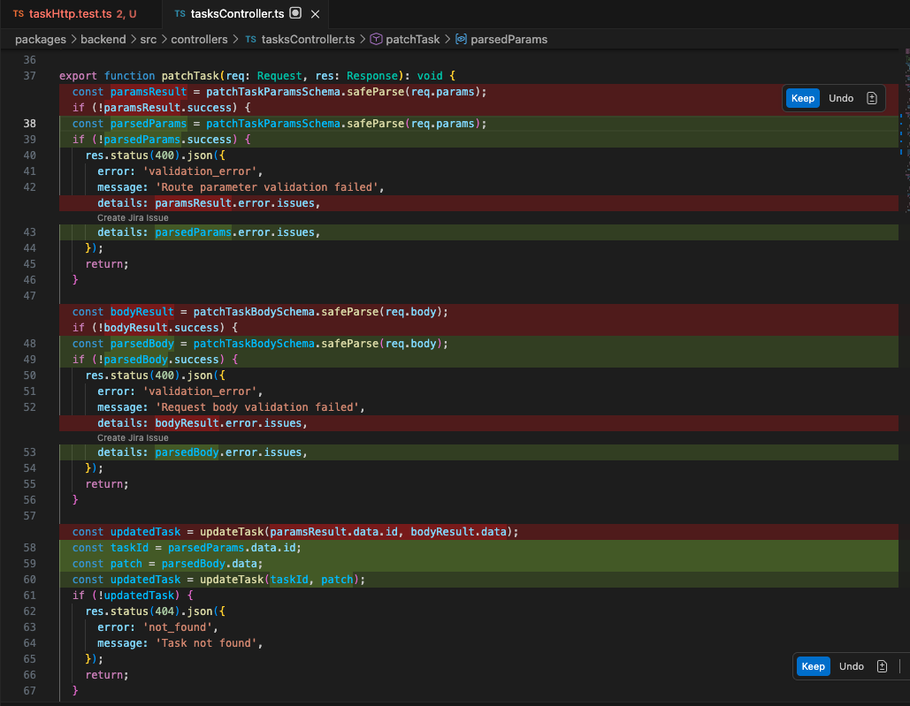
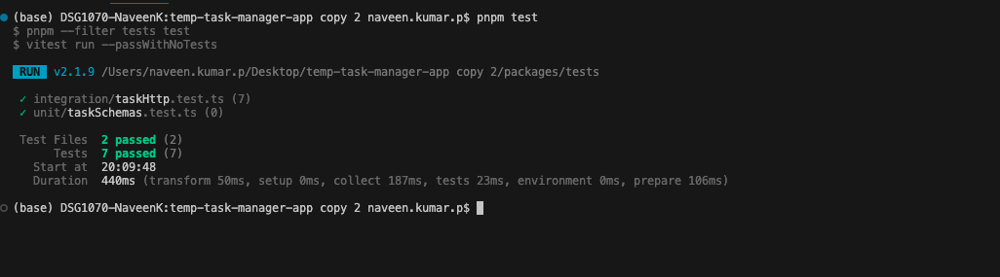
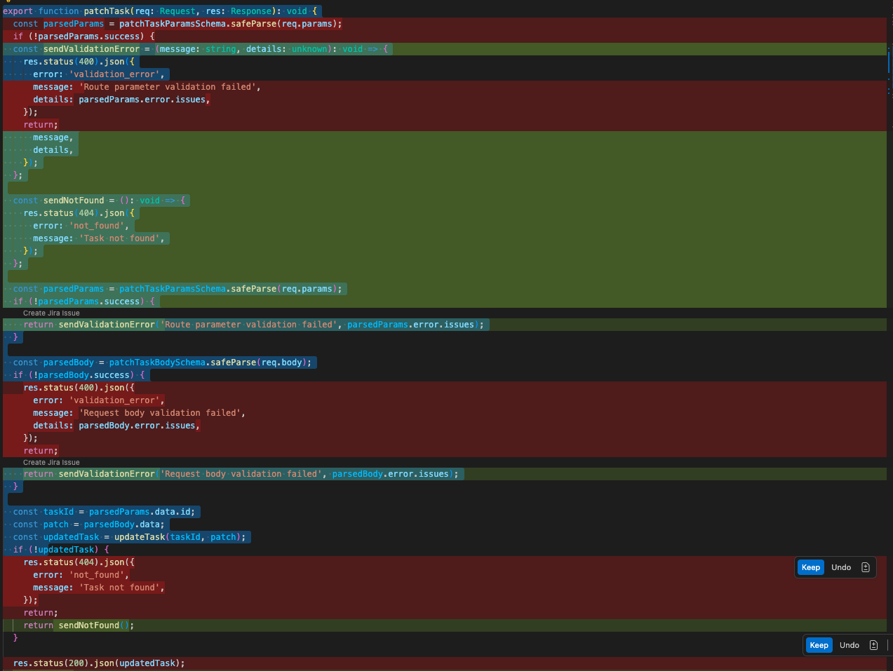
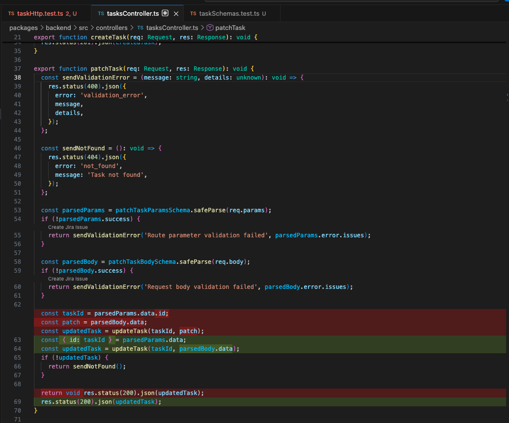
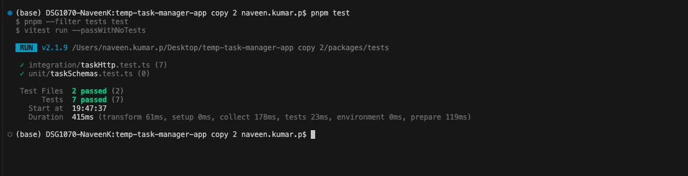

## In-Class Exercise Solution

This file provides sample answers for the exercise.

Learners do not need to match these prompts word for word.

A correct answer should:

```text
1. Give Copilot enough project context.
2. Protect the intended behavior.
3. Keep each Red / Green / Refactor phase separate.
4. Include: Do not run tests or terminal commands.
```

---

## Task 3 — Red / Green / Refactor for `PATCH /tasks/:id`


## Task 3 Part A — Red Solution

### Set up the red tab hygiene

- Let’s open the files Copilot needs to generate the implementation.

```text
packages/tests/integration/taskHttp.test.ts
packages/backend/src/types/task.ts
```

- Make sure to keep the following files closed:

```text
packages/backend/src/schemas/task.ts
packages/tests/unit/taskSchemas.test.ts
packages/backend/src/controllers/tasksController.ts
packages/backend/src/app.ts

```

### red prompt

```text
The contract and validation schema for PATCH /tasks/:id are defined.

The handler is currently a stub that returns 501.

Generate tests that assert the documented behaviors. Tests must fail until the handler is implemented.

Cover exactly:

  (1) Happy path: valid id and valid body returns 200 with the updated task

  (2) 404: task id does not exist

  (3) 400: request body is empty — no fields sent at all

  (4) 400: id is not a valid format, for example, a string instead of a number

Name each test after the rule it enforces.

Use Vitest + supertest.

Do not run tests or terminal commands.
```

---

### What a correct red step should produce

- A correct red step should add tests similar to:



- The exact assertions may differ depending on the existing test style.

- The important point is that the tests should fail while `patchTask()` returns `501`.

---

### When the test are run

- All tests for PATCH should fail



## Task 3 Part B — Green Solution

###  Set up the green tab hygiene

- Open the files Copilot needs to generate the implementation.

```text
packages/tests/integration/taskHttp.test.ts
packages/backend/src/schemas/task.ts
packages/backend/src/controllers/tasksController.ts
```

- Make sure to keep the following files closed:
  
```text
packages/backend/src/types/task.ts
packages/tests/unit/taskSchemas.test.ts
packages/backend/src/app.ts
```

- Make sure to be on tab:

```text
packages/backend/src/controllers/tasksController.ts
```

### Green prompt

```text
Implement the PATCH /tasks/:id handler so every test above passes.

Do not add behaviors, endpoints, or fields that the tests do not require.

Validate the route parameter before validating the request body.

Keep validation aligned with the contract.

Reject an empty request body using the existing PATCH body validation.

Use the existing update logic to return 404 when the task does not exist.

Return the updated task when the update succeeds.

Do not run tests or terminal commands.
```

---

### Expected green implementation




---

### After implementing green 
-  when tests are run 
  



---

## Task 3 Part C — Refactor Solution

### Step 1: Set up the refactor tab hygiene

- Let’s open the files Copilot needs to generate the implementation.

```text
packages/backend/src/controllers/tasksController.ts
packages/tests/integration/taskHttp.test.ts
```

- Make sure to keep the following files closed:

```text
packages/tests/unit/taskSchemas.test.ts
packages/backend/src/schemas/task.ts
packages/backend/src/app.ts
```


- Make sure to be on tab:

```text
packages/backend/src/controllers/tasksController.ts
```


### Sample refactor prompt

```text
Refactor handler patchTask() for clarity only.

For example, improve local variable names or simplify local control flow inside this same function.

All tests must still pass with no changes to test expectations.

Do not alter status codes, response body shapes, or validation rules.

Do not weaken the empty-body validation rule.

Do not move code to new files.

Do not run tests or terminal commands.
```

---

### Acceptable refactor example

- This is acceptable because it improves naming slightly without changing behavior:




### After implementing refactor 
-  when tests are run 
  


---


## Task 4 — Constrained Refactoring

---


### Open the target file

- open the working tab :

```text
packages/backend/src/controllers/tasksController.ts
```

Find:

```text
patchTask()
```

- Select only the `patchTask()` function, or place the cursor inside it.

- Do not select the whole file.


### Unconstrained prompt

```text
Refactor this function.

Do not run tests or terminal commands.
```

## Expected implementation




---

###  risks involved

```text
Risks:

1. Copilot could rename patchTask(), which would break the route import in packages/backend/src/routes/tasksRoutes.ts.

2. Copilot could simplify or bypass patchTaskBodySchema and accidentally remove the empty-body validation enforced by the .refine() rule.

3. Copilot could inline sendValidationError differently and change the 400 response shape from { error: 'validation_error', message, details }.

4. Copilot could reorder validation so the request body is parsed before the id is checked, changing the behavior when both the id and body are invalid.

5. Copilot could change the 404 response body or status code while trying to make the code look cleaner.

6. Copilot could extract helper code into a new file, increasing scope and creating unnecessary import or path issues.
```


---

# Task 4 Part B — Fully Constrained Prompt Solution

###  Set up the constrained refactor tab hygiene

- Open the files Copilot needs to generate the implementation.

```text
packages/backend/src/controllers/tasksController.ts
packages/tests/unit/taskSchemas.test.ts
packages/tests/integration/tasksHttp.test.ts
```

- Make sure to keep the following files closed:

```text
packages/backend/src/schemas/task.ts
packages/backend/src/app.ts
packages/backend/src/routes/tasksRoutes.ts
```

### constrained prompt

```text
Refactor for readability only, inside patchTask().

Do not rename the function or its parameters.

Do not change status codes, response body shapes, or validation behavior.

Do not remove, bypass, or weaken patchTaskBodySchema.

Do not remove the empty-body validation rule.

Do not change the error shape returned by sendValidationError.

Do not reorder validation — id validation must happen first.

Do not move code to new files or change route wiring.

All existing tests must still pass without any changes to test code.

Do not run tests or terminal commands.

```

### Expected implementation




### After implementation
-  when tests are run 
  


---


