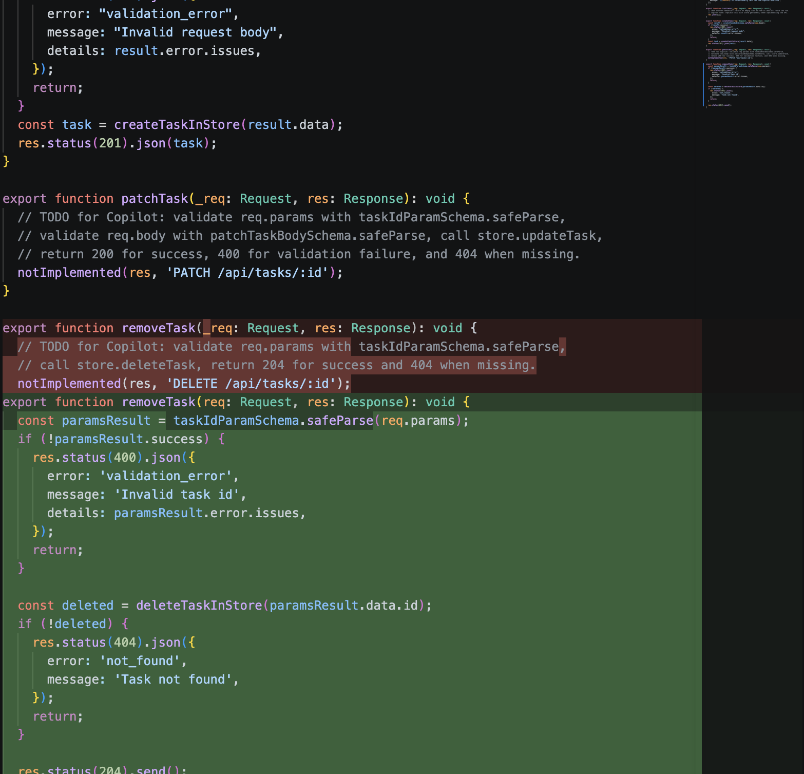
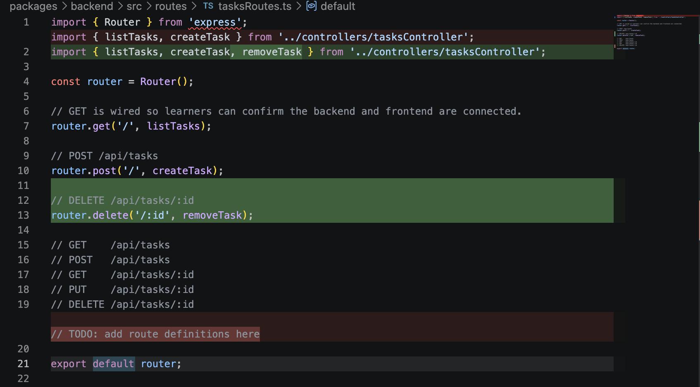
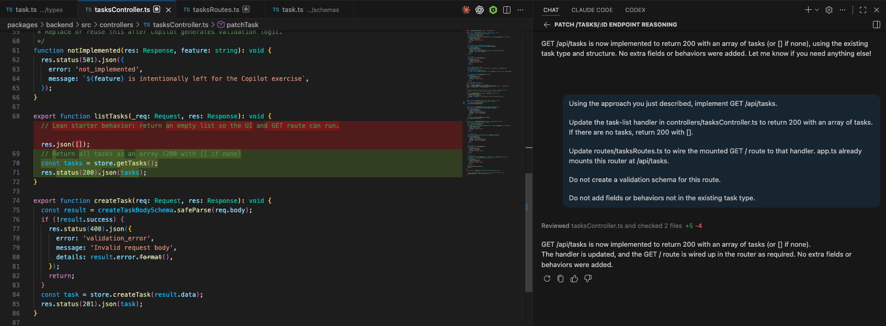
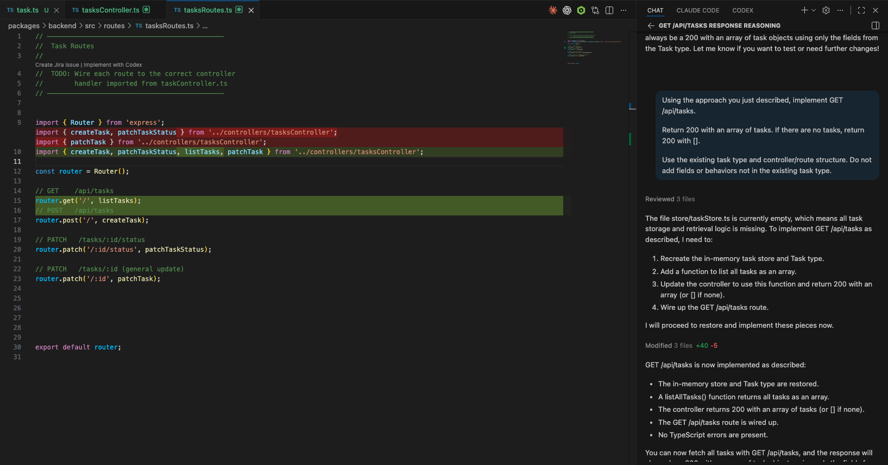

## In-Class Exercise Solution - Contract-First Prompting and Chain-of-Thought 1

This file provides sample answers for the exercise.

Learners do not need to match these prompts word for word.

A correct answer should:

```text
1. Give Copilot enough project context.
2. Protect the intended behavior.
3. Keep contract, validation, and routing concerns aligned.
4. Avoid adding behaviors not required by the task.
```

---

## Activity 1 — Contract-First Prompting for `DELETE /tasks/:id`

## Activity 1 Part A — Contract Solution

### Contract answer

```typescript
/**
 * DELETE /tasks/:id
 * @param {number} id - URL params arrive as strings but this app coerces
 *                      the id to a number using the schema.
 * @returns {204}      // deleted with no body
 * @returns {400}      // id failed validation
 * @returns {404}      // id valid but task missing
 */
export interface DeleteTaskParams {
  id: number;
}
```

---


### Set up the tab hygiene

- Open the files Copilot needs to generate the implementation.

```text
packages/backend/src/types/task.ts
packages/backend/src/controllers/tasksController.ts
packages/backend/src/routes/tasksRoutes.ts
```

- Make sure to keep the following files closed:

```text
packages/backend/src/schemas/task.ts
packages/backend/src/app.ts
packages/backend/src/store/taskStore.ts
```

### Prompt solution

```text
Use the contract for DELETE /tasks/:id defined in packages/backend/src/types/task.ts.

Validate the route id using the app's id scheme.

Use .safeParse on the route params.

Return the correct status codes and response shapes as defined in the contract.

Do not add fields or behaviors not specified in the contract.
```

---

### What a correct result should include

#### Handler

In `packages/backend/src/controllers/tasksController.ts`, the generated handler should:

- validate the route `id`
- return `400` for malformed or invalid ids
- return `404` when the task does not exist
- delete the task when found
- return `204` with no body on success



#### Route wiring

In `packages/backend/src/routes/tasksRoutes.ts`, the generated route should:

- import the delete handler
- connect `DELETE /:id` to that handler
- keep route wiring separate from controller logic




#### Supporting schema

Copilot may also generate:

```text
packages/backend/src/schemas/task.ts
```


---

## Activity 2 — Chain-of-Thought for `GET /api/tasks`

## Activity 2 Part A — Reasoning Prompt Solution

### Set up the reasoning tab hygiene

- Open the files Copilot needs for the reasoning step.

```text
packages/backend/src/types/task.ts
packages/backend/src/controllers/tasksController.ts
packages/backend/src/routes/tasksRoutes.ts
```

- Make sure unrelated files stay closed:

```text
packages/backend/src/schemas/task.ts
packages/backend/src/app.ts
packages/backend/src/store/taskStore.ts
```

### Reasoning prompt solution

```text
Before writing any code, reason through GET /api/tasks.

- What should the response look like when tasks exist?
- What should happen when there are no tasks?
- What status code should always be returned on success?
- Are there any concerns with exposing fields that the client does not need?

Do not write implementation code yet.
```

---

### What the reasoning should conclude

- tasks exist -> return `200` with an array of task objects
- no tasks -> return `200` with `[]`
- success status remains `200`
- any field-exposure concerns should be acknowledged

---

## Task 2 Part B — Implementation Prompt Solution

### Set up the implementation tab hygiene

- Open the files Copilot needs to generate the implementation.

```text
packages/backend/src/types/task.ts
packages/backend/src/controllers/tasksController.ts
packages/backend/src/routes/tasksRoutes.ts
```

- Make sure to keep the following files closed:

```text
packages/backend/src/schemas/task.ts
packages/backend/src/app.ts
packages/backend/src/store/taskStore.ts
```

### Implementation prompt solution

```text
Using the approach you just described, implement GET /api/tasks.
Return 200 with an array of task objects on success.
If there are no tasks, return 200 with [].
Do not create a validation schema for this route.
Do not add fields or behaviors not in the existing task type.
```

---

### What a correct result should include

#### Handler

In `packages/backend/src/controllers/tasksController.ts`, the handler should:

- return `200` with an array of tasks
- return `200` with `[]` when no tasks exist
- treat an empty list as a valid success case
- avoid generating a validation schema for this route



#### Route wiring

In `packages/backend/src/routes/tasksRoutes.ts`, the route should:

- import the list-tasks handler
- connect `GET /` to that handler
- keep route wiring separate from handler logic



---
